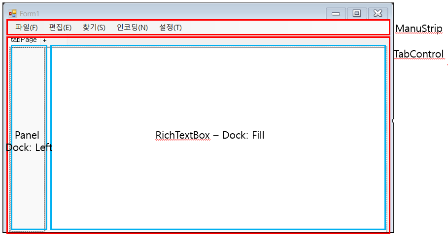

# TextEdit 만들기
#### 다양한 Component를 활용한 TextEdit 만들기
## UI 구조

- MenuStrip
- TabControl
    - Panel - Dock: Left
    - RichTextBox - Dock: Fill

## 문제 상황 해결
```
1. 패널이 에디터를 밀어내지 않고 겹치거나 경계가 이상하게 보이는 이유
  -> 패널이 먼저 도킹되어야(또는 뒤로 보내져야) Fill 컨트롤이 남은 공간을 차지
 ```